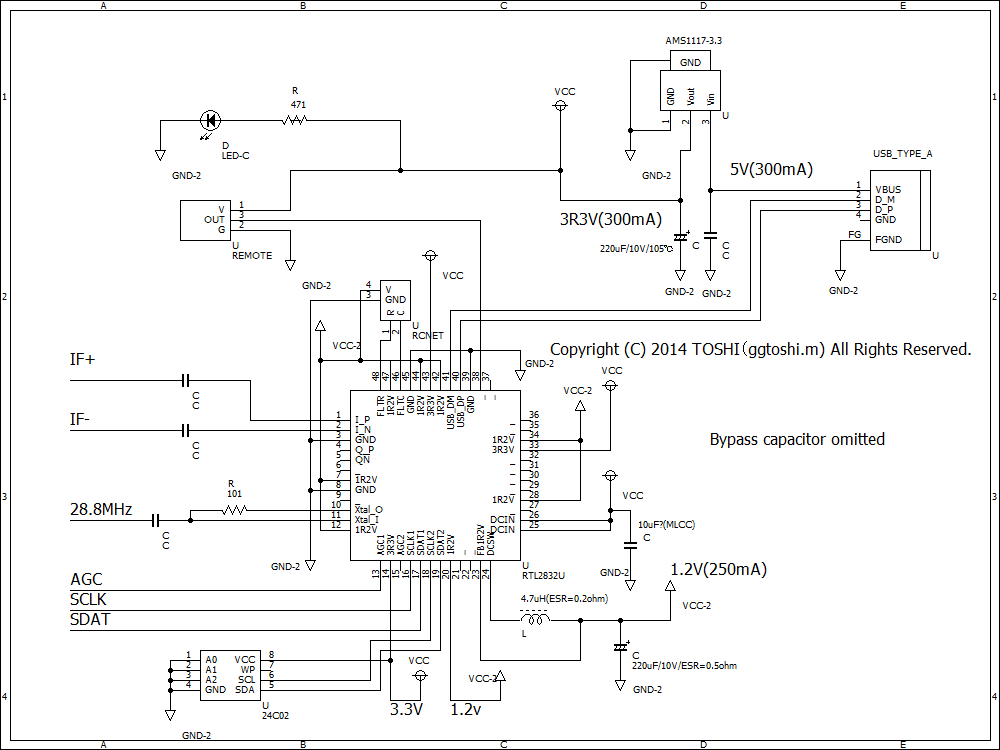
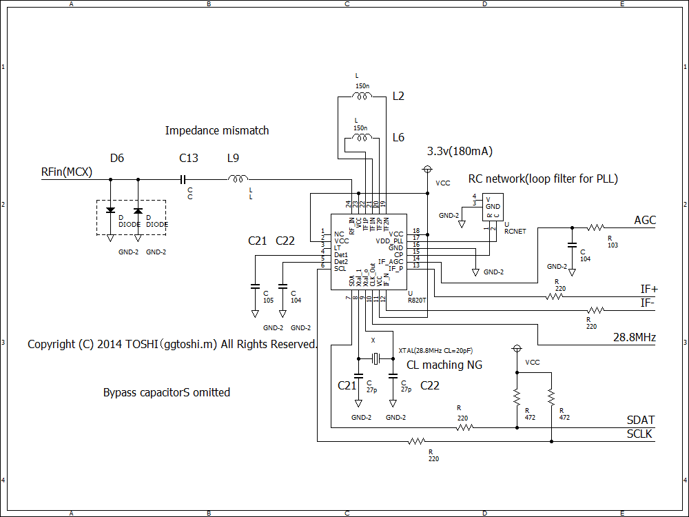

## 综述

RTLSDR设备泛指RTL2832U/P为解调器的电视棒设备。

软件定义无线电最核心的一点是原始的基带信号。RTLSDR设备可以通过特殊的驱动，以8位的精度采样到2.4MS/s的IQ信号（该速率样本不丢失）。

请注意，2832U实际有效位大概仅在7位左右，动态范围接近50dB。

rtlsdr也是一个在linux上的软件包，可以提供对于librtlsdr库的交互。例如测试、SDR功能、FM功能。

## 调谐器类型

调谐器的种类决定了电视棒的频率接收范围，请确保你的操作频段在所购买的电视棒的范围内。

| 型号 | 范围 | 备注 |
|  --  |  --  |  --  |
| Elonics E4000 | 52 - 1100 MHz；1250 - 2200 MHz | 适用；**购买难度高** |
| Rafael Micro R820T(2) |	24 - 1766 MHz | 适用 | 
| Rafael Micro R828D |	24 - 1766 MHz | 适用 | 
| Rafael Micro R860 |	24 - 1766 MHz | 适用 | 
| Fitipower FC0013 | 22 - 1100 MHz  | 适用；**购买难度高** | 
| Fitipower FC0012 | 22 - 948.6 MHz | **不建议购买** |  
| FCI FC2580 | 146 - 308 MHz；438 - 924 MHz| **不建议购买**  | 

## R820T(2)、R828D、R860 有什么区别？

R820T2是R820T的工艺改良版，一定程度提高了灵敏度、频率锁定等方面。

R820T于2010年问世、R820T2于2016年问世。曾在2018年短暂停产，但按照最新的公开信息查询，Rafael Micro已经恢复了对于R820T2的量产。

R828D问世于2013年，和R820T的结构大体相同，主要区别在于射频输入，R828D具有3个射频输入。但这并不影响ADSB接收站的搭建，除非选择自行设计接收板。

R860可以说是R820T2的改名，这代表着他俩之间几乎一样。根据公开资料，R860的制造流程的某个环节发生了变化。目前尚不明确为何Rafael Micro修改了命名策略，这似乎不太符合电子行业的传统。

## 其他资料

### R820T2 

- [寄存器手册（V1.3 2014014）](/pdf/R820T2_Register_Description_V1.3_2014014.pdf)

### R820T

- [芯片手册（V1.2 20111130）](/pdf/R820T_datasheet-Non_R-20111130_unlocked.pdf)

## 其他参考

### 来自GGToshi（部分内容不准确）

